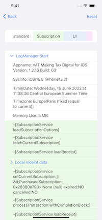
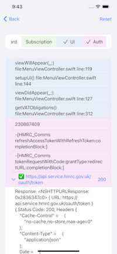

# DJLogging-Swift

[](https://github.com/Carthage/Carthage)

DJLogging is a Swift library for iPhone / iPad and Mac. It allows you to log points in code with associated data so if a user of your app contacts you you will have more information to help.

Fully compatible with both Swift and Objective-C projects

Use my [iOS LogViewer](https://github.com/ddaddy/LogViewer) app to easily read the logs on an iOS device

 

## Integrate using SPM

Simply use SPM to add the package `ddaddy/DJLogging-Swift.git`

## Integrate using Carthage

Install [Carthage](https://github.com/Carthage/Carthage#installing-carthage) if not already available 

Change to the directory of your Xcode project, and Create and Edit your Cartfile and add DJLogging:

``` bash
$ cd /path/to/MyProject
$ touch Cartfile
$ open Cartfile

github "ddaddy/DJLogging-Swift.git" ~> 1.0
```

Save and run:

``` bash
$ carthage update
```

Drop the Carthage/Build/iOS .framework in your project.

For more details on Cartage and how to use it, check the [Carthage Github](https://github.com/Carthage/Carthage) documentation


## How to Use - Swift
#### Defined methods that can be called as is:
```swift
LogMethodCall(type: DJLogType = .standard)
```
```swift
LogMethodCall(_ param: String? = nil, type: DJLogType = .standard)
LogMethodCall(_ param: Double? = nil, type: DJLogType = .standard)
LogMethodCall(_ param: Int? = nil, type: DJLogType = .standard)
```
```swift
LogMethodCall(_ uuid: UUID?, type: DJLogType = .standard)
LogMethodCall(_ uuid: UUID?, logs: [String], type: DJLogType = .standard)
```
```swift
LogRequestResponse(uuid: UUID?, response: URLResponse?, data: Data?, error: Error?, type: DJLogType = .standard)
```

#### Methods
```swift
func htmlString() -> String
func htmlData() -> Data
func clearLog()
```

### Define your own log types
```swift
class DJLogTypeComms: DJLogType {
    static var shared: DJLogType = DJLogTypeComms()
    var id: UUID = UUID()
    var name: String = "comms"
    var colour: DJColor = DJColours.orange
}

extension DJLogType where Self == DJLogTypeComms {
    static var comms: DJLogType { DJLogTypeComms.shared }
}
```

## How to Use - Objective-C
#### Defined methods that can be called as is:
```objective-c
LogMethodCall
```	
```objective-c
LogMethodCallWithType(<DJLogType>*)
```
```objective-c
LogMethodCallWithUUID(NSUUID *)
```	
```objective-c
LogMethodCallWithUUIDAndType(NSUUID*, <DJLogType>*)
```
```objective-c
LogRequestResponseWithUUID(NSUUID *)
```	
```objective-c
LogRequestResponseWithUUIDAndType(NSUUID *, <DJLogType>*)
```	
#### Use the Singleton to access below methods
```objective-c
[LogManager sharedInstance]
```
#### Methods
```objective-c
+ (void)logTitle:(NSString * _Nonnull) log:(NSString * _Nullable) uuid:(NSUUID * _Nullable) type:(id<DJLogType> _Nonnull)
```	
```objective-c
+ (void)logRequestResponse:(NSURLResponse * _Nullable) data:(NSData * _Nullable) error:(NSError * _Nullable) uuid:(NSUUID * _Nullable) type:(id<DJLogType> _Nonnull)
```	
```objective-c
+ (NSString *)htmlString;
+ (NSData *)htmlData;
+ (void)clearLog;
```

### Define your own log types
```objective-c
@interface DJLogTypeComms : NSObject <DJLogType>
@end
@implementation DJLogTypeComms

static DJLogTypeComms *_sharedInstance = nil;
static NSUUID *_uuid = nil;

+ (id<DJLogType> _Nonnull)shared {
    static dispatch_once_t onceToken;
    dispatch_once(&onceToken, ^{
        _sharedInstance = [[self alloc] init];
    });
    
    return _sharedInstance;
}

- (NSUUID *)id {
    static dispatch_once_t onceToken;
    dispatch_once(&onceToken, ^{
        _uuid = [[NSUUID alloc] init];
    });
    
    return _uuid;
}

- (NSString *)name { return @"comms"; }
- (UIColor *)colour { return [DJColours orange]; }

@end
```

## License	

Copyright (c) 2019 Darren Jones (Dappological Ltd.)
